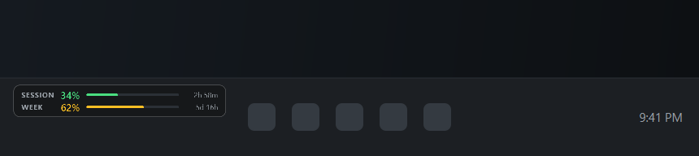
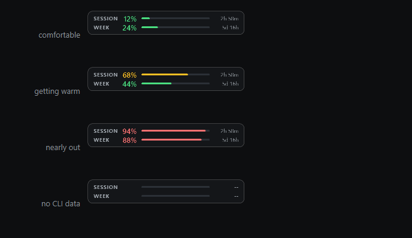

<div align="center">

# Claude Code Overlay

**A frameless desktop widget that sits in your Windows 11 taskbar and shows how much of your Claude Code plan you have left.**

[](https://github.com/Murra/claude-code-overlay/releases/latest)
[](LICENSE)
[](https://www.python.org/downloads/)
[](../../actions)



</div>

---

## What it does

The two numbers that actually govern your day are how much of the current session you have
burned and how much of the week — and, just as importantly, when each one resets. The overlay
puts both on a progress bar in the corner of your screen, so you can pace a long session
without breaking flow to type `/usage`.

```
┌────────────────────────────────────────┐
│ SESSION  21%  ▇▇▇▁▁▁▁▁▁▁▁▁▁▁▁   4h 12m │
│ WEEK     25%  ▇▇▇▇▁▁▁▁▁▁▁▁▁▁▁   5d 17h │
└────────────────────────────────────────┘
                262 x 40 px
```

It is sized to sit **inside** the Windows 11 taskbar rather than floating above it: the taskbar
is 48 logical pixels tall, so a 40-pixel overlay clears it with room on either side. Token
counts have not gone away — they live in the hover tooltip, where the full input / output /
cache breakdown belongs.

## Features

| | |
|---|---|
| **Both limits at a glance** | Session and weekly usage, each with its own progress bar, threshold colour and countdown to reset. |
| **Reset countdowns** | `4h 12m`, `5d 17h` — parsed from the CLI's absolute stamps, because "how long have I got" beats "Sep 19, 12pm". |
| **Fits the taskbar** | 262x40, anchored bottom-left over the taskbar, DPI-correct on mixed-scaling multi-monitor setups. One click parks it just above instead. |
| **Token detail on hover** | Input, output and both cache counters, de-duplicated by request ID, read from `~/.claude/projects/**/*.jsonl`. |
| **Cleans up after itself** | Each plan-limit probe starts a real session and leaves a transcript. A janitor removes them, so the app does not litter `~/.claude` with ~700 dead files a day. |
| **Finds WSL sessions** | Runs Claude Code inside WSL? The Windows overlay auto-discovers `\\wsl.localhost\<distro>\home\<user>\.claude` and merges it in. |
| **Always visible, never in the way** | `Tool` window flag keeps it off the taskbar and out of Alt-Tab. Stays on top until you toggle it off. |
| **Drag anywhere** | Anchored bottom-left by default; drag it somewhere else and the position sticks. |
| **Threshold colours** | Green under 60%, amber under 85%, red above — per bar, so a hot session reads red while the week stays green. |

| **Tray icon** | Show/hide, refresh, or start minimized with `--minimized`. |
| **Scroll to fade** | Mouse-wheel over the widget adjusts opacity. |
| **Never crashes on bad data** | Missing logs, truncated lines, locked files and CLI timeouts all degrade to `--` or a short status string. |



Each bar is coloured independently, so a session you are burning through reads amber or red while
the week beside it stays green. When the CLI reports nothing, both rows fall back to `--` rather
than inventing a number.

## Quick start

### Download the executable

1. Grab **`ClaudeCodeOverlay.exe`** from the [latest release](../../releases/latest).
2. Double-click it. There is no installer and it needs no admin rights.
3. The overlay appears in the bottom-left corner.

Windows SmartScreen flags unsigned binaries the first time you run one. Either choose
**More info → Run anyway**, or verify the published hash first:

```powershell
Get-FileHash .\ClaudeCodeOverlay.exe -Algorithm SHA256
```

### Run from source

This is a Windows desktop application, so run it with **Windows Python** — from PowerShell or
Command Prompt, not from inside a WSL shell:

```powershell
git clone https://github.com/Murra/claude-code-overlay.git
cd claude-code-overlay

py -3 -m venv .venv
.venv\Scripts\activate

pip install -r requirements.txt
python src\main.py
```

Python 3.10–3.14. PyQt6 ships prebuilt wheels for all of them, so nothing is compiled.

> **Running `pip install` inside WSL will fail**, with `sipbuild` trying to build PyQt6 from
> source and asking for `qmake`. That is WSL's Linux Python picking up a Linux source
> distribution; it has nothing to do with the overlay. Use Windows Python. If your Claude Code
> sessions run inside WSL, that is fine and fully supported — see
> [Using it with WSL](#using-it-with-wsl) below.

### Command-line flags

| Flag | Effect |
|---|---|
| `--minimized` | Start hidden; use the tray icon to show it. |
| `--no-tray` | Skip the tray icon entirely. |
| `--reset-position` | Ignore the saved position and re-anchor to bottom-left. |
| `--verbose` | Debug logging to `~/.claude-code-overlay/overlay.log`. |
| `--clean-probe-logs` | Delete the transcripts CLI probes left behind, then exit. |
| `--dry-run` | With `--clean-probe-logs`, list what would go without deleting it. |
| `--version` | Print the version and exit. |

## Using it

| Action | Result |
|---|---|
| Left-drag | Move the overlay. The position is saved on release. |
| Double-click | Force an immediate refresh. |
| Scroll wheel | Fade in / out. |
| Right-click | Refresh Now · Always on Top · Reset Position · Layout ▸ · Dock Over Taskbar · Count Cache Tokens · Hide · Exit |
| Hover | Tooltip with both limits and their reset times, plus the token breakdown: input, output, cache read/write, message count, model, project and session ID. |
| Tray click | Show / hide the overlay. |

### Layouts

Right-click → **Layout** switches between two painters:

```
rows (default)                            compact
┌────────────────────────────────────┐    ┌────────────────────────────────────┐
│ SESSION  21%  ▇▇▇▁▁▁▁▁▁▁▁   4h 12m │    │ SESSION  21%               4h 12m  │
│ WEEK     25%  ▇▇▇▇▁▁▁▁▁▁▁   5d 17h │    │ ▇▇▇▇▇▁▁▁▁▁▁▁▁▁▁▁▁▁▁▁▁▁▁▁▁▁▁▁▁▁▁▁▁  │
└────────────────────────────────────┘    │ WEEK     25%               5d 17h  │
                                          │ ▇▇▇▇▇▇▁▁▁▁▁▁▁▁▁▁▁▁▁▁▁▁▁▁▁▁▁▁▁▁▁▁▁  │
                                          └────────────────────────────────────┘
```

`rows` keeps each metric on one line and reads more calmly at actual size. `compact` gives each
bar the full width of the widget, which is a louder signal when you are near a limit.

**Count Cache Tokens** controls the token total in the tooltip, not the bars. It is off by
default: prompt-cache reads are billed at a fraction of normal input tokens and routinely
outnumber them a hundred to one, so folding them into the total makes a long session look far
more expensive than it was. The raw cache figures are listed either way.

## Using it with WSL

A very common setup is Claude Code running inside WSL while the desktop is Windows. The logs
then live in the WSL filesystem, not in your Windows user profile, so
`C:\Users\<you>\.claude\projects` is empty or absent and a naive reader finds nothing.

The overlay handles this automatically. On startup — and every few minutes after — it asks
`wsl.exe` which distributions are **running**, then scans each one's
`\\wsl.localhost\<distro>\home\<user>\.claude\projects`. Anything it finds is merged with the
Windows profile directory, and the newest transcript across all of them wins.

```
discovered transcript directories:
    C:\Users\you\.claude\projects                        (if it exists)
    \\wsl.localhost\Ubuntu\home\you\.claude\projects     (auto-discovered)
```

Two deliberate choices worth knowing about:

- **Only running distributions are probed.** Touching `\\wsl.localhost\<distro>` *boots* a
  stopped distribution, and a desktop widget has no business starting a VM to look for files
  nobody is writing. A distro with a live Claude Code session is running by definition.
- **Discovery is cached** for `discovery_ttl_s` (5 minutes), but retries every 15 seconds while
  nothing has been found — so starting WSL after the overlay does not leave it blank for long.

Scanning over the WSL UNC path costs roughly 130 ms per poll on a typical history, which is
comfortably inside the 2-second interval. If you would rather point at it explicitly, or you
use a distro layout the probe misses, set the path by hand:

```jsonc
{
  "parser": {
    "extra_projects_dirs": ["\\\\wsl.localhost\\Ubuntu\\home\\you\\.claude\\projects"],
    "auto_discover_wsl": false
  }
}
```

## Configuration

Settings live in `%USERPROFILE%\.claude-code-overlay\config.json`, written on first exit.
Anything you leave out falls back to the default, and an unparseable file is ignored rather
than fatal — so it is safe to edit by hand.

```jsonc
{
  "window": {
    "width": 262,
    "height": 40,                // keep under 48 to stay inside the taskbar
    "corner_radius": 8,
    "layout": "rows",            // "rows" or "compact"
    "anchor_over_taskbar": true, // false parks it above the taskbar instead
    "margin_x": 8,               // inset from the left screen edge
    "margin_y": 4,               // inset from the bottom screen edge
    "pos_x": null,               // set automatically when you drag the widget
    "pos_y": null,
    "always_on_top": true,
    "topmost_interval_ms": 500,  // re-assert z-order; 0 disables (see below)
    "start_hidden": false,
    "show_tray_icon": true,
    "opacity": 0.94
  },
  "polling": {
    "session_interval_ms": 5000,   // local log scan (tooltip detail only)
    "cli_interval_ms": 120000,     // plan-limit probe — drives the display
    "cli_timeout_s": 5.0,          // hard kill for the subprocess
    "max_lines_per_file": 250000
  },
  "theme": {
    "ok_color": "#4ade80",
    "warn_color": "#fbbf24",
    "critical_color": "#f87171",
    "warn_threshold": 60.0,
    "critical_threshold": 85.0,
    "accent": "#d97757",
    "font_family": "Segoe UI"
  },
  "parser": {
    "include_cache_tokens": false,
    "latest_session_only": true,   // false sums every session from the last hour
    "session_window_s": 3600,
    "context_window_tokens": 200000,
    "cli_enabled": true,
    "cleanup_probe_logs": true,    // delete the transcripts our own probes create
    "cleanup_min_age_s": 30,       // never touch a transcript younger than this
    "max_session_candidates": 8,   // how far back to look for a session with real usage
    "auto_discover_wsl": true,     // find Claude Code logs inside running WSL distros
    "extra_projects_dirs": [],     // additional transcript directories to merge in
    "discovery_ttl_s": 300
  }
}
```

Set `CLAUDE_CONFIG_DIR` to point the parser at a Claude Code state directory other than
`~/.claude` — the same variable Claude Code itself honours.

### Staying above the taskbar

`WindowStaysOnTopHint` is not enough on its own. The Windows taskbar is a topmost window too,
and topmost windows are ordered among themselves by activation — so clicking the taskbar raises
it above the overlay, which then looks like it has vanished. Qt sets the style once and does not
defend the position afterwards.

The overlay therefore re-asserts its own z-order two ways:

- A `SetWinEventHook` on `EVENT_SYSTEM_FOREGROUND` corrects the z-order as soon as another
  window takes the foreground, which is what clicking the taskbar does.
- A `SetWindowPos(HWND_TOPMOST, …, SWP_NOACTIVATE)` call on a `topmost_interval_ms` timer backs
  that up and bounds the worst case. `SWP_NOACTIVATE` matters: re-asserting never steals the
  click you just made.

One trap worth recording, since it cost a debugging cycle here. `ctypes` marshals an undeclared
Python `int` as a 32-bit C `int`, so passing `HWND_TOPMOST` (-1) straight through produces
`0x00000000FFFFFFFF` on x64 instead of a sign-extended handle. `SetWindowPos` then returns 0 and
does nothing — silently, unless you check. Handles are passed as `wintypes.HWND` with explicit
`argtypes`, and a failed call is logged once.

Set `topmost_interval_ms` to `0` to switch both off.

### The one case this cannot fix

While the **Start menu, Search, or another shell flyout is open**, Windows raises the taskbar
into an immersive z-order band that a normal application cannot enter. The overlay is covered
for as long as that surface is open, and reappears the moment it closes.

This is not a bug that can be worked around from user code. Measured with `WindowFromPoint` at
the overlay's own centre pixel, with the Start menu open:

```
SetWindowPos(overlay, HWND_TOPMOST)   rc=1  -> still covered
SetWindowPos(taskbar, after=overlay)  rc=1  -> still covered
BringWindowToTop(overlay)             rc=1  -> still covered
```

Every call reports success and none of them changes what is painted. Entering that band
requires a `uiAccess="true"` manifest, which in turn requires a binary signed by a trusted
certificate and installed under `Program Files` — not something a portable open-source `.exe`
can or should do.

**If this bothers you, right-click → untick "Dock Over Taskbar".** The overlay then parks just
above the taskbar and stays visible through everything, at the cost of ~44px of desktop in the
bottom-left corner. Verified against the Start menu, Search and File Explorer.

Note that ordinary windows never cause this. Opening File Explorer, maximising a browser, or
clicking a taskbar button to raise an app all leave the overlay alone, or cover it only for the
~200ms the re-assert takes.

## Architecture

```
       ┌──────────────────────────────┐   ┌────────────────────────────────┐
       │ C:\Users\<you>\.claude\        │   │ \\wsl.localhost\<distro>\home\  │
       │   projects\<slug>\*.jsonl      │   │   <you>\.claude\projects\*.jsonl│
       └──────────────┬───────────────┘   └───────────────┬────────────────┘
                      │                                    │
                      └──────────┬─────────────────────────┘
                                 │  parser.resolve_projects_dirs()
                                 │  read-only, every 5s
                 ┌──────────────▼───────────────┐        ┌────────────────────┐
                 │  parser.SessionScanWorker     │        │ parser.CliProbe-   │
                 │  • newest file *with usage*   │        │ Worker             │
                 │  • json.loads per line        │        │ • claude -p /usage │
                 │  • skip malformed lines       │        │ • 5s timeout       │
                 │  • de-dup by requestId        │        │ • disk cache       │
                 └──────────────┬───────────────┘        └─────────┬──────────┘
                                │  QThread                          │  QThread
                 ┌──────────────▼──────────────────────────────────▼──────────┐
                 │                   parser.UsageMonitor                       │
                 │      one worker of each kind at a time; signals only        │
                 └──────────────────────────┬─────────────────────────────────┘
                                            │  Qt signals (GUI thread)
                 ┌──────────────────────────▼─────────────────────────────────┐
                 │                  main.OverlayWindow                         │
                 │   two bars + countdowns · drag · tray · context menu         │
                 │   limits drive the face; tokens fill the tooltip             │
                 └────────────────────────────────────────────────────────────┘
```

### How the log parsing works

Every line in a session transcript is one JSON object. The ones that matter look like this:

```json
{
  "type": "assistant",
  "requestId": "req_011Cf25FkCX88FovVKXFnD7c",
  "timestamp": "2026-09-13T20:31:48.619Z",
  "message": {
    "model": "claude-opus-5",
    "usage": {
      "input_tokens": 2,
      "output_tokens": 278,
      "cache_creation_input_tokens": 318,
      "cache_read_input_tokens": 38839
    }
  }
}
```

Three details make the difference between a number you can trust and one you cannot:

1. **De-duplication.** A single assistant turn is often written to the transcript more than
   once — once per content block, and again when a streamed response is finalised. Each copy
   carries the *same* `usage` object. Summing naively inflates the total, sometimes by 2-3x,
   so records are keyed on `requestId` (falling back to `message.id`, then `uuid`) and counted
   once.

2. **Cache tokens are separate.** `cache_read_input_tokens` routinely dwarfs `input_tokens` by
   two orders of magnitude, and is billed at roughly a tenth of the price. The headline number
   is `input + output`; cache traffic is opt-in via the context menu.

3. **The file is live.** Claude Code holds the transcript open and appends to it. Reads are
   non-exclusive on Windows, but the last line is frequently a partial write. Every line is
   parsed inside a `try`, malformed ones are counted in `skipped_lines`, and the total is still
   returned.

### About the plan-limit readout

There is no documented API for your plan quota, so the overlay shells out to the CLI. As of
September 2026, `claude -p /usage` answers with:

```
You are currently using your subscription to power your Claude Code usage

Current session: 17% used · resets Sep 13, 10:20pm (America/New_York)
Current week (all models): 24% used · resets Sep 19, 12pm (America/New_York)
```

The probe scrapes those percentages, prefers the weekly figure for the badge, pairs it with the
matching reset time, and caches the result in `~/.claude-code-overlay/cache.json`. That cache is
what gets displayed when a later probe fails, so the badge does not flicker back to `--` after
one bad run.

Two things worth knowing, both learned the hard way:

- **`/usage` is tried first, `/status` second.** `claude -p /status` replies "/status isn't
  available in this environment", and takes ~2.5 s to say so. Probing it first doubled the
  round trip for nothing. It is kept only as a fallback in case that reverses.
- **Each probe writes a session transcript of its own.** `claude -p` starts a real session, so
  it leaves a `.jsonl` behind in your *Windows* profile containing no assistant turns. Those
  files are always the newest on disk, so a naive "newest file wins" rule locks the overlay onto
  an empty transcript and reports **0 tokens forever**. The parser therefore walks newest-first
  and takes the first transcript that actually recorded usage, bounded by
  `parser.max_session_candidates`. They are also deleted — see [The janitor](#the-janitor).

Because the output format is not a stable contract, `tests/test_parser.py` pins the verbatim
text above — if the wording changes upstream, a test fails rather than the badge quietly going
blank.

If the probe finds nothing, the badge shows `--` and the bar falls back to a local
context-window estimate. **Local token counting is unaffected** — it never touches the CLI. Set
`parser.cli_enabled` to `false` to skip the probe entirely, which also stops it creating those
transcripts.

### The janitor

At one probe every two minutes, the transcripts described above accumulate at roughly 30 files
an hour — about 700 a day, for files that contain nothing. The janitor removes them.

It runs after every probe, deleting the transcript that probe just created, and sweeps any
older strays left by previous runs. `--clean-probe-logs` does the same thing on demand, and
`--clean-probe-logs --dry-run` lists what it would remove without touching anything.

Deleting files under `~/.claude` is the most dangerous thing this program does, so a file must
clear every one of these to be removed:

| Condition | Why |
|---|---|
| Smaller than 64 KB | A real conversation is not a couple of kilobytes. |
| **No assistant turn anywhere** | Nothing was ever generated in it. This alone disqualifies almost every real transcript. |
| Older than `cleanup_min_age_s` (30s) | A session being written right now is never a candidate. Explicitly-named files from the probe that just finished are the one exception. |
| In `parser.projects_dir` only | Discovered WSL directories are never swept. The probe runs locally, so its litter is local. |
| Matches one of two signatures | Either it contains a slash command this app invokes (`/usage`), or it contains **no user message at all** — a rejected probe leaves only queue and system rows, and nothing a person typed can be in such a file. |

For a genuine session to match, it would have to contain no response and either nothing you
typed or nothing but `/usage` — in which case there is nothing in it to lose.

Verified against real data on the development machine: of **73 genuine transcripts**, the
matcher flagged **0**. Of 55 files left by this project's own probing, it flagged all 55.
`tests/test_parser.py` pins the safety property directly — a transcript with an assistant turn,
a large file, a different slash command, and a session the user typed into are each asserted to
survive a sweep.

Set `parser.cleanup_probe_logs` to `false` to disable it, or `parser.cli_enabled` to `false` to
stop creating the files in the first place.


## Building the executable

```bash
pip install -r requirements.txt
python build.py --clean
```

Output lands at `dist/ClaudeCodeOverlay.exe` — one file, roughly 35 MB, with the icon
embedded and no console window.

| Flag | Effect |
|---|---|
| `--clean` | Wipe `build/` and `dist/` first. |
| `--onedir` | Folder build instead of one-file — starts faster, easier to debug. |
| `--console` | Keep a console window so tracebacks are visible. |
| `--no-upx` | Disable UPX compression (some antivirus engines dislike packed binaries). |

Anything after the flags is passed straight through to PyInstaller.

### Releasing

`.github/workflows/release.yml` runs tests on Windows and Linux, builds the binary on
`windows-latest`, and publishes a GitHub Release with the `.exe` plus its SHA-256 whenever a
`v*.*.*` tag is pushed:

```bash
git tag v1.0.0
git push origin v1.0.0
```

Use **Actions → Release → Run workflow** to build without publishing.

## Development

```
claude-code-overlay/
├── .github/workflows/release.yml   Test + build + publish on tag
├── src/
│   ├── config.py                   Dataclass settings, JSON persistence
│   ├── parser.py                   Log parsing, CLI probe, Qt workers
│   └── main.py                     Frameless window, painting, tray, menu
├── assets/
│   ├── icon.ico                    Multi-resolution, 16 → 256 px
│   └── make_icon.py                Regenerates the icon, zero dependencies
├── tests/test_parser.py            55 tests over the parsing engine
├── build.py                        PyInstaller wrapper
└── requirements.txt
```

```bash
python -m pytest tests -q
```

`tests/test_parser.py` covers the cases that actually happen in the wild: corrupted lines,
truncated writes, duplicate request IDs, negative counts, a missing `~/.claude` directory,
and unparseable CLI output, reset stamps that roll over the year, and the two PyQt thread-lifetime
traps that make a worker silently never run or abort the process on exit.

The icon is generated, not committed as an opaque blob — `assets/make_icon.py` rasterises it
with nothing but the standard library, so you can change the colours and re-run it.

## Troubleshooting

| Symptom | Cause and fix |
|---|---|
| Shows `No ~/.claude logs` | Claude Code has not run on this machine, or your state directory is elsewhere. Set `CLAUDE_CONFIG_DIR`, or add the path to `parser.extra_projects_dirs`. |
| Empty while Claude Code runs in WSL | The distro must be running for auto-discovery to see it. Check `wsl -l --running`, then run with `--verbose` and look for "Discovered WSL transcript directories" in the log. |
| `sipbuild` / `qmake` error from `pip install` | You are installing with WSL's Linux Python. Use Windows Python — see [Run from source](#run-from-source). |
| Shows `No sessions yet` | The directory exists but holds no transcripts. Start a Claude Code session. |
| Both bars show `--` | The CLI probe found nothing parseable, so there are no limits to draw. Run `claude -p /usage` yourself to check it works; the tooltip still has your token counts. |
| Tooltip token total looks too high | Turn off **Count Cache Tokens** in the right-click menu. |
| Tooltip stuck at 0 tokens | An empty transcript is shadowing the real one. Raise `parser.max_session_candidates`, or set `parser.cli_enabled` to `false` so the probe stops creating them. |
| Overlay covers taskbar buttons | Drag it somewhere emptier, or set `window.anchor_over_taskbar` to `false` to park it just above the taskbar instead. |
| Countdown reads like `Sep 19, 12pm` | The stamp could not be parsed into a time, so the raw text is shown. Please open an issue with the exact line from `claude -p /usage`. |
| Overlay is off-screen after a monitor change | Right-click → **Reset Position**, or run with `--reset-position`. |
| Nothing appears at all | Check `~/.claude-code-overlay/overlay.log`, or run `python src/main.py --verbose`. |
| Hidden behind a fullscreen game | Exclusive-fullscreen apps bypass every always-on-top window. Use borderless windowed mode. |
| Overlay disappears when you click the taskbar | It should return within ~200ms. If it does not, check that `window.topmost_interval_ms` is not `0`. |
| Overlay hidden while the Start menu is open | Expected, and not fixable from user code — see [The one case this cannot fix](#the-one-case-this-cannot-fix). Right-click → untick **Dock Over Taskbar** to avoid it entirely. |

## Privacy

The overlay reads local files and counts integers. It makes no network requests, sends no
telemetry, and never reads the `content` field of your messages — only the `usage` block. The
only things it writes are its own config, cache and log under `~/.claude-code-overlay/`.

## Contributing

Issues and pull requests are welcome. Please run `python -m pytest tests -q` before opening a
PR, and keep the parser's rule intact: **it must never raise into the event loop.** A new data
source should degrade to a status string, not an exception.

## License

[MIT](LICENSE) © 2026 Michael Murra

Not affiliated with Anthropic. "Claude" and "Claude Code" are trademarks of Anthropic, PBC.
